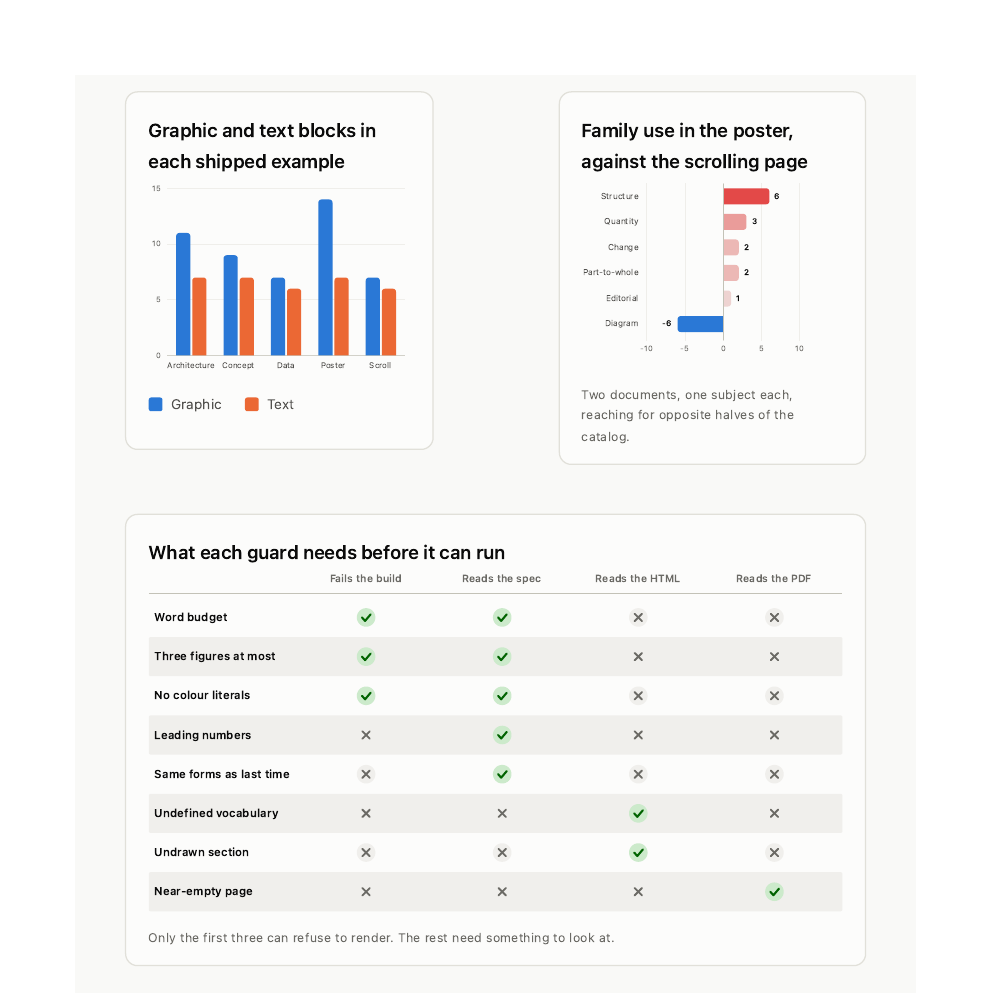
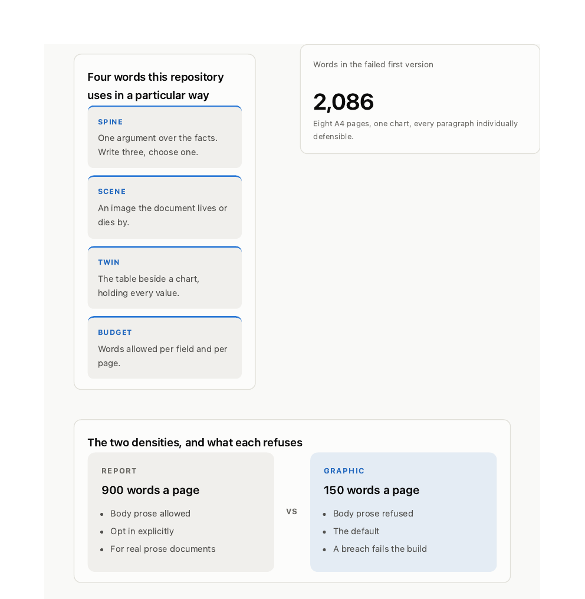
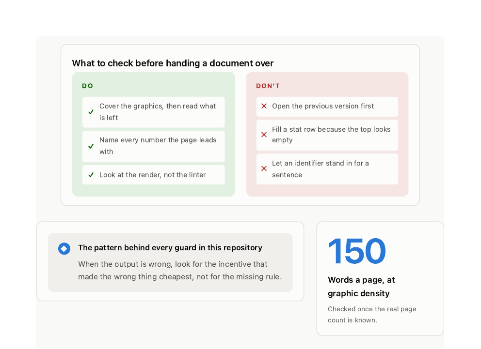

# The specimen gallery

Every form this skill draws, drawn. Nothing on this page is a mock-up or a
sketch of a chart: each sheet is a rendered A4 page out of the same pipeline any
document goes through, and each one is trimmed to its content.

**The data is this repository.** Every number here is read at build time from the
block registry, `density.CAPS`, the five shipped fixture specs, the linter's own
`add(...)` calls and `git log`. Nothing was typed in twice, so the gallery cannot
quietly drift from the code it documents, and nothing was invented to complete a
shape. Rebuild the whole page with:

```bash
sh assets/build_gallery.sh
```

## Quantity


`bar` `lollipop` `heatmap` `scatter`. The printable area of every render target;
how graphic each shipped example actually is; which families each one draws
from; and whether a longer document is a more graphic one. It is not: the
scatter is close to a straight line through the origin, which is the finding.



`column` `diverging` `matrix`. The diverging chart is a real signed comparison,
not a bar chart with a baseline moved: two documents of one subject each,
reaching for opposite halves of the catalog. The matrix earns its space because
the rows genuinely differ. Its first draft put the nine render targets against
four properties and eight of the nine rows came out identical, which is a table
pretending to be a finding.

## Change


`line` `area` `dumbbell` `slope`. The line is the one place in this repository
`zero: false` is the honest call: bars start at zero because length encodes
magnitude, but a line encodes movement, and 25 to 29 against a zero baseline is
a flat line that says nothing. The area chart's spike is four page screenshots
landing in the repo and then being replaced. On the slope chart, structure and
diagram change places, which is what a slope chart is for.

## Part-to-whole


`treemap` `donut` `unit` `funnel` `share_bar` `meter`. Five ways to read one
whole, each picked for a different reason: relative area when the sizes are
wildly different, a circle when there are at most six parts, countable squares
when a ratio should stay literal, a stage-by-stage drop, a split read once, and
one value against a real ceiling.

## Structure


`pyramid` `process` `cycle` `venn` `tree`. The cycle is the loop the linter
cannot close for you: it checks structure, and it has never once looked at a
document.


`quadrant` `sankey` `stack`. The quadrant's note says what it is: placement is a
judgement about the form, not a measurement. A 2×2 is worth drawing when all
four corners are named, not when the dots are precise.

## Diagram


`swimlane` `scorecard` `gauge` `figure`. The swimlane is the argument for the
whole skill: steps two to six sit in the top lane and cannot be automated. The
figure is the one specimen the catalog cannot supply. Three spines over one set
of facts is not a tree (they do not partition anything), not a process (they are
alternatives, not steps) and not a quadrant (there are no axes). Naming the
closest block type needs a "well, sort of", which is the test for authoring the
shape instead.


`chips`. All 49 aliases, so a spec can be written in ordinary words.

## Editorial



`definitions` `stat` `comparison`. The stat sets `compact: false`, because the
block otherwise renders 2,086 as "2.1K" and the exactness is the entire point of
the number.



`checklist` `callout` `hero_figure`. The checklist is at span 12 rather than 6.
At half width its two columns are about 90px each and every item wrapped to one
word a line, which the render showed and the linter did not.

## What is not on this page, and why

Five forms are missing, and the reason is the same in every case: this
repository has no honest data for them, and principle four says a missing series
stays missing.

| Form | Why it is absent |
|---|---|
| `likert` | Needs a real five-point survey. There isn't one. |
| `timeline` | Wants dates that carry the argument. Every commit here landed on one day. |
| `anatomy` · `image` | Both need a photograph or a screenshot as their subject. |
| `kpi` | Deliberate. It is the block this skill added a guard against, and putting a row of four numbers at the top of a specimen sheet would teach exactly the reflex that guard exists to stop. |

## Two honest defects

**The images are light, so they glare in dark mode.** Fixing it properly needs a
validated dark theme, which does not exist yet. A theme is a JSON file, not code,
but it has to clear the contrast, categorical-separation and colour-vision gates
before it can ship.

**The build still reports one warning.** `near-empty-page` fires on the Change
sheet at 6% ink against a 10% median. It is measuring correctly: four line, dot
and slope charts genuinely put less ink on a page than four filled ones. The
check is tuned for documents rather than specimen sheets, and it is left
reported rather than suppressed.
