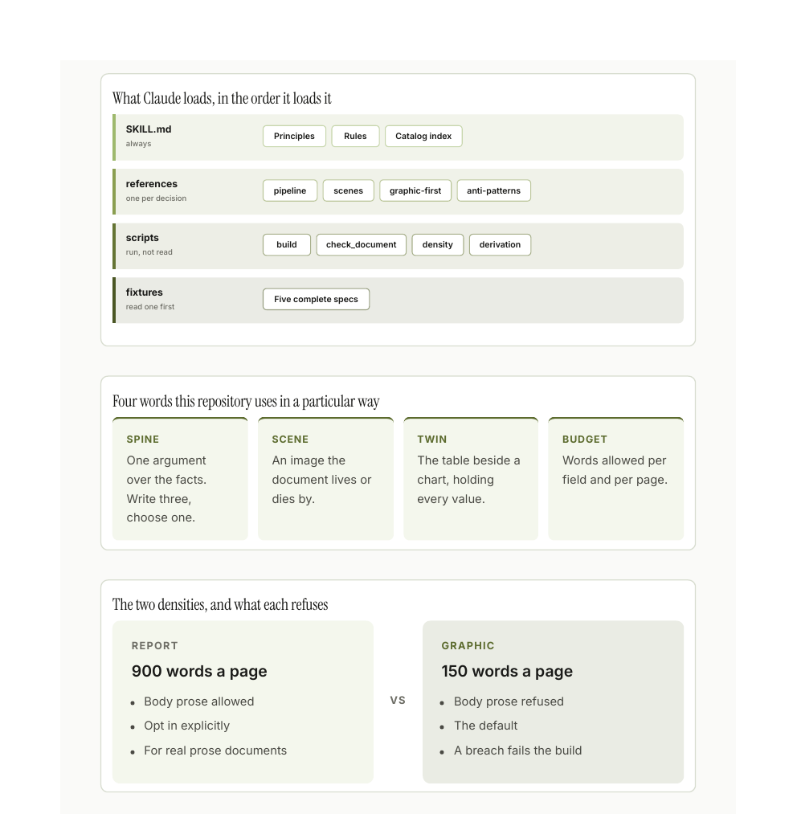

# The specimen gallery

Every form this skill draws, drawn. Nothing on this page is a mock-up or a
sketch of a chart: each sheet is a rendered A4 page out of the same pipeline any
document goes through, and each one is trimmed to its content. Thirty-six
specimens over nine sheets, in the `rentos` theme.

**The data is this repository.** Every number here is read at build time from the
block registry, `density.CAPS`, the five shipped fixture specs, the linter's own
`add(...)` calls and `git log`. Nothing was typed in twice, so the gallery cannot
quietly drift from the code it documents, and nothing was invented to complete a
shape. Rebuild the whole page with:

```bash
sh assets/build_gallery.sh
```

**Rows flow, they are not broken per family.** Forcing a page break before each
family left four sheets nearly blank. Letting the rows run means a family's last
half-width specimen shares a sheet with the next family's first, which is what
the compound sheet names below record.

## Quantity


`lollipop` `heatmap` `bar` `column` `scatter` `diverging`. How graphic each
shipped example actually is; which families each draws from; the printable area
of every render target; and whether a longer document is a more graphic one. It
is not: the scatter is close to a straight line through the origin, which is the
finding. Two of the five examples land on the identical point, so they share one
label rather than being nudged apart, because moving a real value to make room
for its own label is the one thing a chart may never do.

The diverging chart is a real signed comparison, not a bar chart with a baseline
moved: two documents of one subject each, reaching for opposite halves of the
catalog.

## Guards, and the start of change


`matrix` `line` `area`. The matrix earns its space because the rows genuinely
differ. Its first draft put the nine render targets against four properties and
eight of the nine rows came out identical, which is a table pretending to be a
finding.

The line is the one place in this repository `zero: false` is the honest call:
bars start at zero because length encodes magnitude, but a line encodes
movement, and 25 to 29 against a zero baseline is a flat line that says nothing.
The area chart's spike is four page screenshots landing in the repo and then
being replaced.

## Change, and part-to-whole


`dumbbell` `slope` `meter` `share_bar` `funnel` `treemap`. On the slope chart,
structure and diagram change places, which is what a slope chart is for. The
meter is a value against a real ceiling rather than an arbitrary one: three
authored figures against a cap of three.

## Part-to-whole, and the principles


`donut` `unit` `pyramid`. Five ways to read one whole appear across these two
sheets, each picked for a different reason: relative area when the sizes are
wildly different, a circle when there are at most six parts, countable squares
when a ratio should stay literal, a stage-by-stage drop, and a split read once.

The unit chart normalises to a hundred squares, so a square is one percent and
not one block type. Its note says the underlying count instead, because a note
that contradicts the legend printed directly above it is worse than no note.

## Structure


`venn` `process` `cycle` `quadrant` `sankey`. The cycle is the loop the linter
cannot close for you: it checks structure, and it has never once looked at a
document. The quadrant's note says what it is: placement is a judgement about
the form, not a measurement. A 2×2 is worth drawing when all four corners are
named, not when the dots are precise.

## Structure, and diagram


`tree` `figure` `scorecard` `gauge` `swimlane`. The swimlane is the argument for
the whole skill: steps two to six sit in the top lane and cannot be automated.

The figure is the one specimen the catalog cannot supply. Three spines over one
set of facts is not a tree (they do not partition anything), not a process (they
are alternatives, not steps) and not a quadrant (there are no axes). Naming the
closest block type needs a "well, sort of", which is the test for authoring the
shape instead.

## Diagram, and editorial



`stack` `definitions` `comparison`. The definitions block is at span 12 rather
than 6. At half width it stacks its four terms vertically and runs to 444px,
which beside the 137px stat left 307px of blank page, the single worst void in
the document.

## Editorial


`checklist` `stat` `hero_figure` `callout`. The checklist is at span 12 for the
same reason as the definitions list: at half width its two columns are about
90px each and every item wrapped to one word a line, which the render showed and
the linter did not. The stat sets `compact: false`, because the block otherwise
renders 2,086 as "2.1K" and the exactness is the entire point of the number.

## Every alias


`chips`. All 49 aliases, so a spec can be written in ordinary words. It is last
in the document rather than in the middle of the diagram family, because it is a
single 911px block: wherever it lands it takes a sheet to itself and pushes
whatever follows onto a fresh one. In the middle that cost two near-empty pages.
At the end it fills the closing sheet, which is the one page allowed to be short.

## How the sheets are packed

A grid row is as tall as its tallest block, so pairing a 444px specimen with a
137px one buys 307px of blank page. Eight such pairs cost 1,400px, an entire
wasted sheet. Specimens are therefore ordered **by rendered height within their
family**, and a family with an odd number of half-width blocks leaves its
*shortest* over to meet the next family, not its tallest.

Those heights are not guessable from the payload, so they are measured:

```bash
python3 assets/measure_blocks.py assets/gallery_spec.json
```

It prints every block's laid-out height and totals the blank left in mismatched
pairs. That total is now 336px across the whole document, down from 1,400px, and
no single pair wastes more than 63px. The document lost a sheet: nine, not ten.

## What is not on this page, and why

Five forms are missing, and the reason is the same in every case: this
repository has no honest data for them, and principle four says a missing series
stays missing.

| Form | Why it is absent |
|---|---|
| `likert` | Needs a real five-point survey. There isn't one. |
| `timeline` | Wants dates that carry the argument. Every commit here landed on one day. |
| `anatomy` · `image` | Both need a photograph or a screenshot as their subject. |
| `kpi` | Deliberate. It is the block this skill added a guard against, and putting a row of four numbers at the top of a specimen sheet would teach exactly the reflex that guard exists to stop. |

## Two honest defects

**The images are light, so they glare in dark mode.** Fixing it properly needs a
validated dark theme, which does not exist yet. A theme is a JSON file, not code,
but it has to clear the contrast, categorical-separation and colour-vision gates
before it can ship.

**The build still reports one warning.** `near-empty-page` fires on the alias
sheet at 8% ink against a 13% median. It is measuring correctly, and it is
measuring the wrong thing here: that sheet is 94% full by area and 8% full by
ink, because a grid of outlined chips is mostly the page showing through. The
check is tuned for documents rather than specimen sheets, and it is left
reported rather than suppressed.
