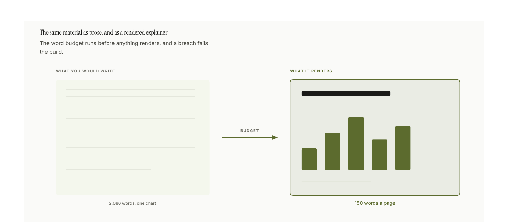
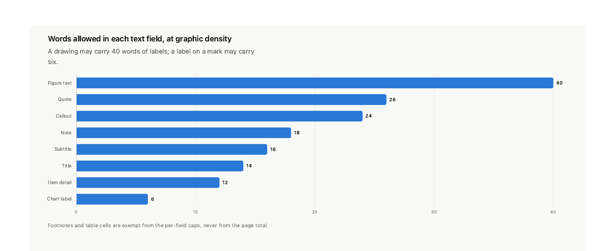

<p align="center">
  <picture>
    <source media="(prefers-color-scheme: dark)" srcset="branding/iris-dark.svg">
    
  </picture>
</p>

<h1 align="center">infographic</h1>

<p align="center"><em>Represent the world.</em></p>

<p align="center">
<a href="https://github.com/remybroun/infographic/actions/workflows/selftest.yml"></a>
<a href="SKILL.md"></a>
<a href="#requirements"></a>
<a href="GALLERY.md"></a>
<a href="#requirements"></a>
<a href="LICENSE"></a>
<a href="branding/"></a>
</p>

A skill that turns a document, a dataset or a topic into a designed visual
explainer: a print-ready PDF, or a continuous scrolling page whose HTML is the
deliverable.

It is not a chart library. It is a set of constraints that make a model produce
a graphic document instead of an essay with figures stapled to it, and most of
those constraints fail the build rather than advise.

```
/infographic <a topic, a path, or a pasted document>
```

## Install

```bash
npx skills@latest add remybroun/infographic
```

That drops it wherever your agent looks for skills, Claude Code included, and
`npx skills update infographic` pulls later versions. It installs into the
current project by default; add `-g` to install it for every project instead.

Or do the same thing by hand, because a skill is only a directory with a
`SKILL.md` in it, and Claude Code finds it on the next session:

```bash
git clone https://github.com/remybroun/infographic.git ~/.claude/skills/infographic
```

To scope a clone to one project, clone into
`<project>/.claude/skills/infographic` instead.

## Verify

```bash
python3 scripts/ig.py selftest          # 423 assertions
python3 scripts/ig.py validate --all    # every theme through the colour checks
python3 scripts/ig.py selftest --render # also builds all six fixtures, to PDF
sh assets/build_gallery.sh              # rebuilds every image on this page
```

The first three are what CI runs on every push, and the badge above is that run.
The fourth is the reproduction command for the figures below: every image on this
page is output of the skill, and one command rebuilds all thirteen from source.

## What it produces



The word budget in `scripts/lib/density.py` runs before anything renders, and a
breach is a build error. That number is not arbitrary: version 1 of this skill
shipped an eight-page explainer carrying **2,086 words and one chart**, and
every paragraph in it was individually defensible. The budget exists because
taste under time pressure always chooses "one more clarifying sentence".

## The vocabulary it draws with


57 block types across seven families, plus 64 aliases so a spec can be written in
ordinary words (`pie` → `donut`, `waffle` → `unit`, `2x2` → `quadrant`,
`flow` → `process`, `myth` → `misconception`).

That figure is a map. Below it are the blocks themselves, rendered: three sheets
out of ten in **[the specimen gallery](GALLERY.md)**, which draws all 41 forms
this repository has honest data for. Every number in it is read out of the repo
at build time, from the registry, the word budget, the five shipped fixtures,
the linter's own checks and `git log`, so it cannot drift from the code it
documents and nothing in it is invented to complete a shape.


When the catalog has no shape for an idea, you draw it. A `figure` block takes
authored SVG and keeps every guarantee the built-in blocks make: required `alt`,
a required data twin, refused colour literals, and its labels charged against the
budget. Capped at three per document, because without a cap "draw the shape the
catalog lacks" becomes "hand-draw everything" and the consistency is gone.


The authored drawing on that sheet is a `figure`. Three spines over one set of facts is
not a tree (they partition nothing), not a process (they are alternatives, not
steps) and not a quadrant (there are no axes). Naming the closest block type
needs a "well, sort of", which is the test for authoring the shape instead.

## How a document gets made

Steps 1–6 are judgement and cannot be automated. 7–11 mostly are.

1. **Source**: read it, or `ig.py extract source.pdf`
2. **Reader and mode**: who reads this, do they have the concept, which words
   are they missing?
2.5. **The ladder** (`lesson` mode): the explanation, before any form is chosen.
   `ig.py ladder out/ladder.json --brief`
3. **Three spines**: three arguments over the same facts, then choose one
4. **Target**: paper, poster, slide, or a continuous scrolling page
5. **Scenes**: which images does this live or die by, *before* opening the catalog
6. **Forms**: one per remaining claim
7. **Spec**: `ig.py new out/spec.json`, and every authored figure drawn twice,
   both compositions rendered alone with `ig.py sketch`
8. **Theme**: validated, never hand-picked
9. **Render**: `ig.py render out/spec.json --out-dir out`
10. **Look at it**: `ig.py shoot out/doc.html`. The linter never has. Then
    `ig.py blind out/doc.html`, because you cannot read your own document.
11. **Hand off**: the spec, the document, and how it was made

Three orderings are load-bearing. **The explanation before the argument**, because
a spine is a claim plus the reasoning that carries it, which is the frame of a
document for somebody who already knows what the subject is. **Three spines
before one is chosen**, because the first argument to arrive is nearly always the
*mechanism*. That is the shape the source is already in, and it is rarely the one
the reader has a stake in. And **scenes named before the catalog is opened**,
because once it is open the question silently changes from *what does this look
like?* to *which of the 57 shapes is closest?*

## Explaining, as opposed to arguing

For three versions this skill could choose a good form for any fact and could not
teach anything, and the cause was structural. Its first artifact was a fact
ledger. Its second was a claim, defined as *one sentence the reader should
believe by the end*. Both are the frame of an argument, so every document opened
on its conclusion and worked backwards, which is the shape of a page written for
somebody who already knows what the subject is.

```json
{"meta": {"mode": "lesson", "ladder": [
  {"says": "One program can run many separate company websites.",
   "introduces": ["application"], "at": "one-program"},
  {"says": "The web address is what tells it which company you want.",
   "introduces": ["web address"], "at": "address-picks"}
]}}
```

A ladder is the explanation, written before a single form is chosen: rungs in the
order a reader climbs them, each naming the terms it teaches and the block it
lands on. **A term used in a block that comes before the rung teaching it is a
build error.** That is the only check here that can see the insider register.
Every other one measures density, form or geometry, and a document passes all of
them while opening on a word the reader will not meet for four more blocks.

Each rung is capped at 24 words, and the cap is the point. "Reflect completely on
how to explain this before drawing anything" is the instruction that produced the
worst document this skill has shipped. An explanation written out in full before
the drawing starts is an essay, and the pictures get added to illustrate it.

`ig.py ladder --brief` hands the rungs alone to a reader with no context, before
anything is rendered, which is the same test `ig.py blind` runs at the end for
the price of a rebuild.

## What the build refuses to render



Three failures stop the build outright: a breach of the word budget, more than
three hand-drawn figures, and a colour literal inside a drawing. The rest warn.

Every one of these guards is a specific document that shipped and should not
have:

| Guard | The failure that produced it |
|---|---|
| Word budget, enforced in code | Version 1 shipped 2,086 words across eight pages carrying one chart |
| At most three hand-drawn figures | Version 2 fixed the word count and hand-drew everything, losing all consistency |
| Colour literals refused in a drawing | Hand-drawn figures are where computed colour slips first |
| Authored tables count toward the budget | A section retyped as three tables passed as clean; the cells were exempt |
| Identifiers counted, definitions required | A page carried 30 identifiers and no definitions block, and passed |
| Graphic forms compared against the last version | A regeneration came back 93% identical, with every step performed honestly |
| A `kpi` row is measured against the document | Four numbers led a page, and all four were explained better further down |
| `invert` without `bleed` | It flips the ink but paints no ground, so a drawing renders light-on-light |
| A term used before the rung that teaches it | An explainer opened on a score and a glossary, and taught nobody anything, while passing every check above |

The pattern is worth stating plainly, because it recurs:

> **When the output is wrong, look for the incentive that made the wrong thing
> cheapest, not for the missing rule.**

The linter rewarded prose, so it got prose. The catalog framed every idea, so
ideas came out catalog-shaped. Table cells were exempt from the budget, so
paragraphs became tables. A six-word label cap makes `skipped_bucket` cheaper
than "the recipient switched that group off", so pages came out labelled in
identifiers only their author could read.

## Themes

`default` (neutral editorial) · `iris` (the house theme, clay and blue) ·
`rentos` (olive editorial, Instrument Serif) · `mono` (greyscale, print-safe).

Every image on this page is `iris`, so what you are looking at is a theme doing
its whole job, and it is the same theme as the mark at the top of the page. Its
page is the mark's cream ground, its accent is the mark's clay, and both its
sequential ramps are struck from the mark's own two hue angles, 39.9° and
251.1° in OKLCH. Its diverging scale runs blue to clay, which is the same
inversion the mark is built on. Block titles are set in the display face over
the sans everywhere else; the serif is opt-in per theme (`type.block_title`),
since a theme whose display face *is* its sans gains nothing from it.

**Status colours come out of the theme, not from outside it.** `good` is the
theme's green slot, `warning` is its gold, and `serious` and `critical` are two
steps down one crimson, which is honest because severity is ordinal. The
version before this one had `critical` at hue 29° and the accent at 40°, so a
DON'T panel painted itself in the house colour, and a `good` green that
appeared nowhere else in the theme, so a tick read as framework chrome. Every
status hue now sits at least 36° clear of the accent.

**The eight categorical slots are deliberately not the brand.** A chart needs
eight separable identities and a brand has two, so forcing the slots to the
brand hues is how "brand-safe" palettes end up unreadable. Clay and blue lead
and the other six are searched, under three rules the gate itself cannot check:
a 36° minimum hue gap, so no two slots collapse into one family; an objective
that maximises the worst pair *anywhere* rather than the worst adjacent pair;
and a lightness spread across the first three, which are the ones a scatter
puts side by side. Each rule exists because the search broke without it. Scored
on adjacency alone it returned four oranges and four blues. Given a 32° gap it
returned two dark crimsons 33° apart. Both are legal, because past slot three
the gate only measures adjacent pairs, and both are useless in a legend. The
gate is a floor, not a target.

That third rule has a ceiling worth writing down, because it is a property of
the page and not of the search. The cream ground stops a chromatic fill
clearing 3:1 above L 0.65, and the two brand slots are pinned at L 0.590 and
L 0.441, so slot three has about 0.06 of lightness to move in. Worse, the
things you want from it fight each other: a high-contrast slot three has to be
dark, which puts it beside navy in lightness, which leaves only hue to separate
them, which is exactly what protanopia takes away. One candidate measured a
comfortable 4.70:1 on the page and a useless 7.5 ΔE from navy for a protanope.
So slot three is taken from the light side, and the trio's colour-vision floor
is held at 15 ΔE so it cannot regress.

One of those checks is new here, and it is new because this theme failed it.
A ramp is supposed to be at its most saturated where it is darkest; the first
`iris` ramp drove chroma with a sine, which is zero at *both* ends, so its last
two steps came out neutral grey and a heatmap read as greyscale wearing a
colour legend. Nothing caught it: the ordinal gate measures hue *spread* and
lightness monotonicity, and a grey has no hue to spread, and a fade to grey is
still perfectly monotone. The gate now requires the dark half of a ramp to hold
40% of that ramp's own peak chroma. Every bundled theme clears it (`rentos` is
closest, at 41%); the ramp that shipped in 3.3.0 held 9%.

All four themes pass the computable colour checks: contrast, categorical
separation, ramp saturation, and colour-vision-deficiency distance. `iris` is
the only one that needs no waiver; `rentos` records one, because brand olive
measures a chroma of 0.087 against a 0.10 floor and a brand colour cannot be
re-stepped. A new theme
is a JSON file, not code. The scorecard in the sheet above counts the checks per
theme; `mono` runs fewer of them because greyscale has fewer categorical slots
to separate, not because it scores worse.

```bash
python3 scripts/ig.py validate --all
python3 scripts/ig.py catalog --sheet out/sheet.pdf --theme mono
```

## Layout

```
SKILL.md              what Claude loads first
references/           one file per decision; load the one that owns it
  pipeline.md           the eleven steps
  graphic-first.md      the word budget, and why it is code
  scenes.md             deciding what gets drawn by hand
  anti-patterns.md      check every document against this before shipping
  teaching.md           the ladder, and the mode that enforces it
  catalog/              the 57 block types, by family
scripts/
  ig.py                 the CLI
  build.py              spec → HTML
  check_document.py     the linter
  lib/density.py        the word budget
  lib/ladder.py         is anything explained before the thing it depends on
  lib/derivation.py     did a regeneration change anything
  lib/leading_numbers.py  is that stat row carrying its weight
fixtures/specs/       six complete, rendering worked examples
GALLERY.md            every form the skill draws, drawn
assets/
  gen_readme.py         the three slides on this page
  gen_gallery.py        the ten specimen sheets, from this repo's own data
  build_gallery.sh      rebuilds every image here in one command
  measure_blocks.py     how tall does each block lay out, so rows can be paired
  trim_png.py           crops the blank tail off a rasterised page
```

## Requirements

Python 3.12+ standard library, and a Chromium-family browser for rendering and
screenshots (set `CHROME_PATH` if it is not found). `poppler` is optional for
building documents, where it reads PDF sources and measures per-page ink
coverage, and required for rebuilding the images on this page, which rasterise
through `pdftoppm`. No pip installs, no npm, no matplotlib.

## Notes on this page

Every image here was produced by the skill. `sh assets/build_gallery.sh` rebuilds
all thirteen from source in one command.

The three wide ones are 16:9 slides from [`gen_readme.py`](assets/gen_readme.py),
built as a paginated target because a README image is a fixed frame and a
paginated page fills it rather than leaving the dead column a scrolling layout
leaves. The specimen sheets are A4 portrait, and that is deliberate too: a text
label is a fixed size in millimetres, so the page *width* is what decides how
large it lands in GitHub's column. A4 portrait puts an 8pt label at roughly 12px;
the 338mm slide puts the same label at roughly 7px.

The sheets set `meta.spacing: "tight"`, which scales the gutter, the row gap and
the padding inside a framed block together. Scaling only the gap does not read as
tighter: two framed charts are held apart by pad + gap + pad, and at the default
that is 62px of which the gap is 26. `tight` is not the default, because in a
document that argues, the gap is what tells a reader one idea has finished.

The eleven pipeline steps and the guard table are not images. An ordered list and
a table render natively, are searchable and copyable, and follow your theme. An
image earns its place when the idea is spatial.

The three slides are the only place in this repo where `tables: false` is set.
The accessibility twin is a `<details>` element, and inside a raster image that
is a control nobody can operate, so the values it would carry sit in the prose
beside each figure instead. The specimen sheets keep their twins in the HTML.

Three things are still wrong, and none of them is faked:

- **The images are light, so they glare in dark mode.** Fixing that properly
  needs a validated dark theme, which does not exist yet.
- **The figure build reports three findings and suppresses none of them.** The
  gallery warns that its `cycle` specimen asked for 380px in a 330px column, and
  it is right; a specimen sheet packs blocks tighter than a document would. The
  three-frame README strip sets `tables: false`, so `no-table-view` fires as an
  error and `sparse-pages` as a warning. Both checks are correct about a
  document and wrong about a raster image frame, where a `<details>` twin is a
  control nobody can operate. That is the one `|| true` in
  `assets/build_gallery.sh`, and the reason is written beside it.
- **The `rentos` theme's fonts live outside this repo.** Its `fonts_dir` points
  at a sibling brand directory, so a fresh clone renders it in Georgia and Helvetica
  instead of Instrument Serif and Inter. The build now warns when a declared font
  file is missing rather than falling back in silence, but the assets are still
  not vendored here.

## The one thing the tooling cannot do

The linter checks structure. It has never once looked at a document, and it
cannot tell you that a label collided, that an arrow points at nothing, that the
drawing was the wrong drawing, or that the argument does not land.

`ig.py shoot` exists so that you can, and `ig.py sketch` so that looking at one
drawing costs two seconds rather than a full render, which is the difference
between a composition chosen and a composition settled for.

Then there is the part you cannot do either. The skill's whole claim is that a
stranger understands the page by looking at it, and the author is the one reader
who is not a stranger: you know what every label means and what the page was
meant to say, so you see the intended document rather than the printed one.
`ig.py blind` prints a brief for a reader with no context at all. What they say
it is about is what it is about.

## Branding


The mark at the top of this page is the **iris**: a disc split down the middle,
an ordered colour ramp in each half, and the two halves running that ramp in
opposite directions, so the disc inverts across its own axis. It is drawn after
two Hilma af Klint paintings, *The Swan* (1915) for the structure and Series
VIII *Utgångsbild* (1920) for the fill.

<br clear="left">

The duality is carried by lightness rather than hue, which is why the one-colour
version is not a degraded copy of it and why it still reads at 16px. Its eight
ramp steps pass the same validator this skill points at every theme, run in
`--ordinal` mode because a ramp is not a set of categories.

Files, usage rules and the exact gate commands are in
[branding/](branding/README.md). Everything there is generated:

```bash
python3 branding/gen_brand.py
```

## License

MIT. See [LICENSE](LICENSE).
