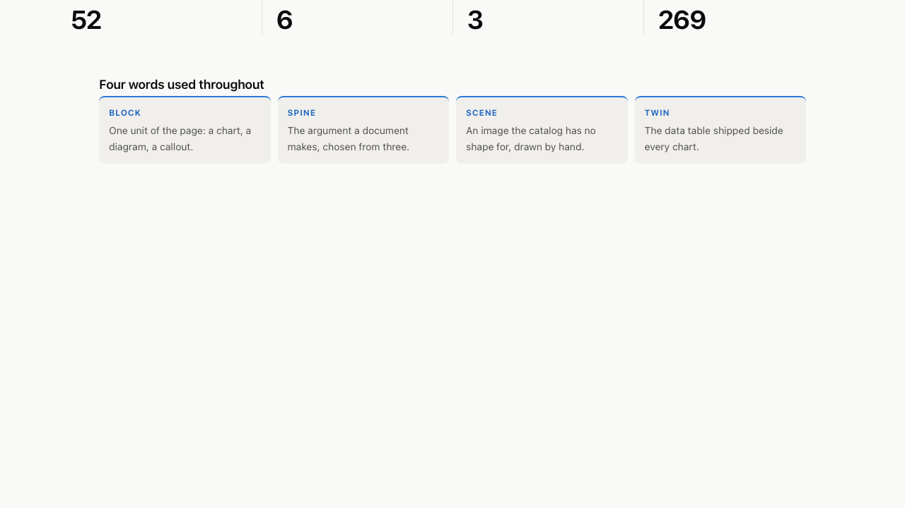
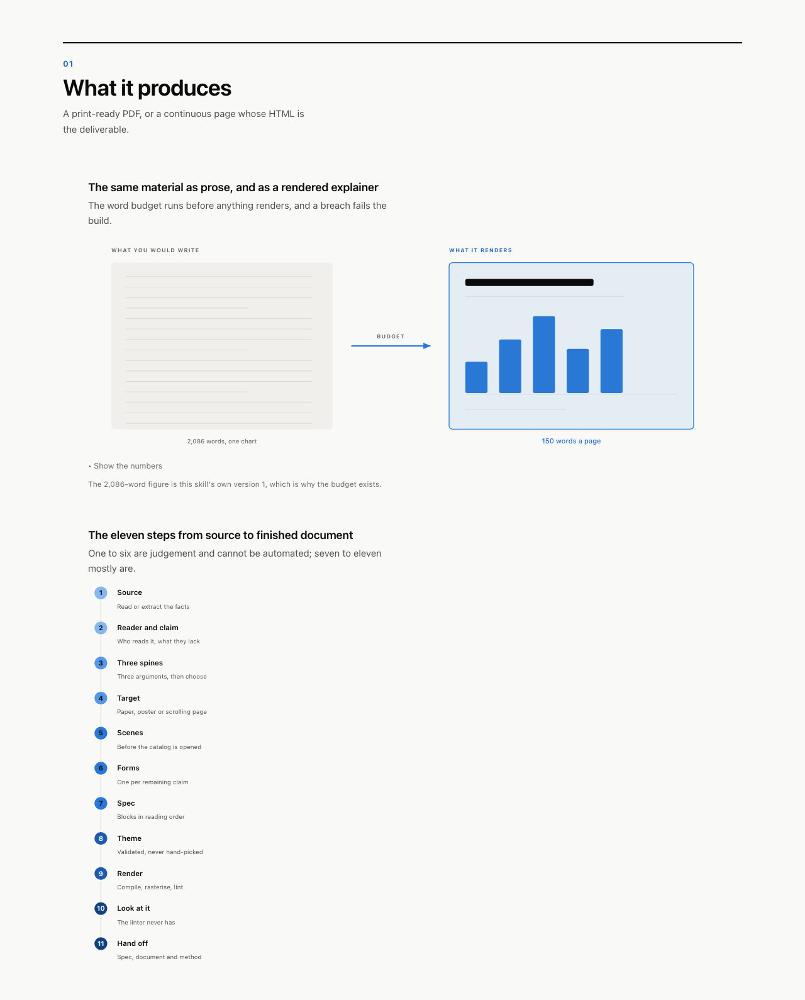
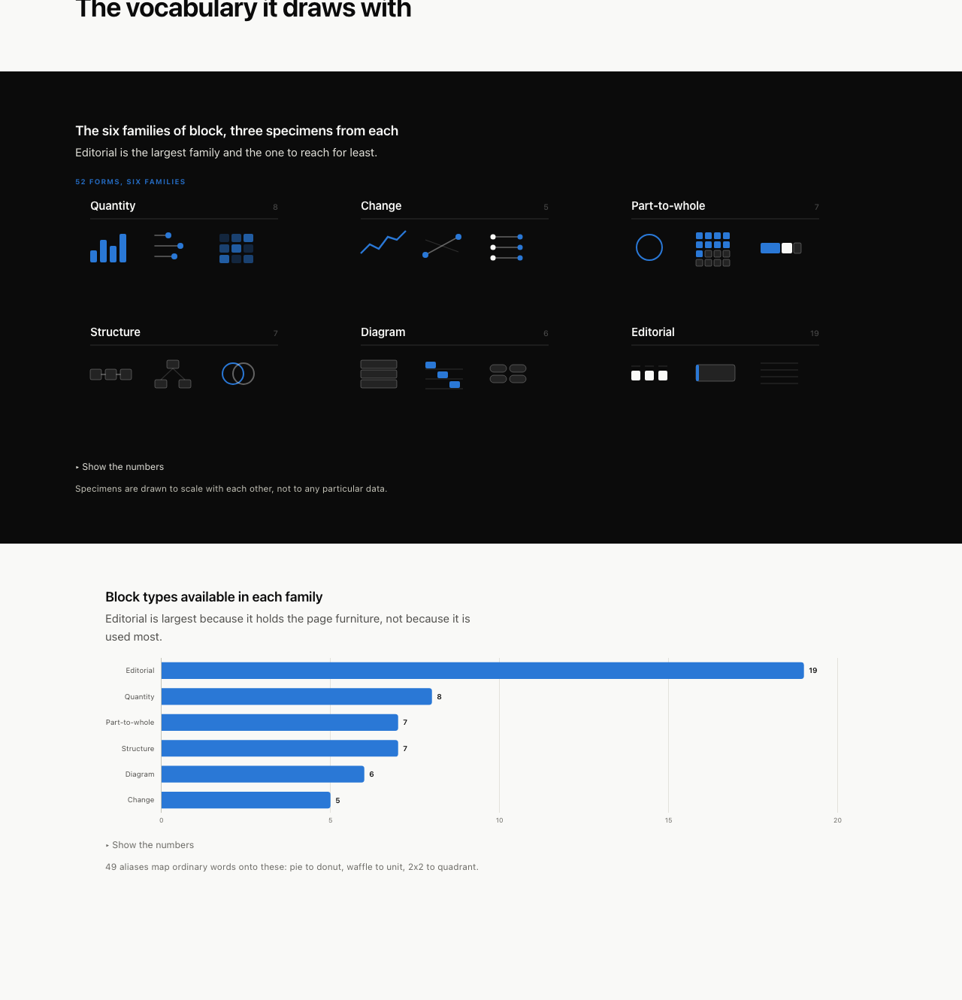
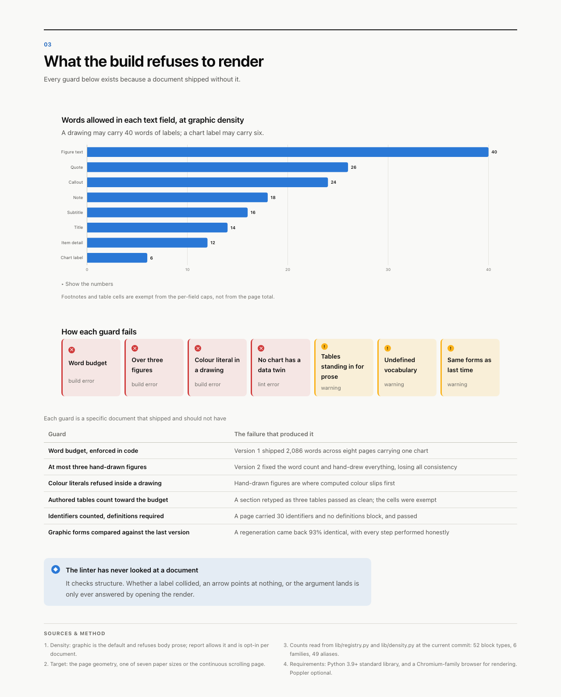

# infographic

A [Claude Code](https://claude.com/claude-code) skill that turns a document, a
dataset or a topic into a designed visual explainer: a print-ready PDF, or a
continuous scrolling page whose HTML is the deliverable.

It is not a chart library. It is a set of constraints that make a model produce
a graphic document instead of an essay with figures stapled to it, and most of
those constraints fail the build rather than advise.



**Every image in this README was produced by the skill itself**, from
`gen_readme.py` → spec → HTML → PNG. If it cannot make its own README, it does
not work.

---

## What it produces

```bash
python3 scripts/ig.py render out/spec.json --out-dir out   # build, render, lint
python3 scripts/ig.py shoot out/doc.html                   # rasterise, then LOOK
```



The word budget in `scripts/lib/density.py` runs before anything renders, and a
breach is a build error, not a warning. That number is not arbitrary: version 1
of this skill shipped an eight-page explainer carrying 2,086 words and one
chart, and every paragraph in it was individually defensible. The budget exists
because taste under time pressure always chooses "one more clarifying sentence".

## The vocabulary it draws with



52 block types, plus 49 aliases so a spec can be written in ordinary words
(`pie` → `donut`, `waffle` → `unit`, `2x2` → `quadrant`, `flow` → `process`).

When the catalog has no shape for an idea, you draw it: a `figure` block takes
authored SVG and keeps every guarantee the built-in blocks make (required `alt`,
a required data twin, refused colour literals, its labels charged against the
budget). Capped at three per document, because without a cap "draw the shape the
catalog lacks" becomes "hand-draw everything" and the consistency is gone.

## What the build refuses to render



Each guard in that table is a real document that shipped and should not have.
The pattern is worth stating plainly, because it recurs:

> **When the output is wrong, look for the incentive that made the wrong thing
> cheapest, not for the missing rule.**

Four for four so far. The linter rewarded prose, so it got prose. The catalog
framed every idea, so ideas came out catalog-shaped. Table cells were exempt
from the word budget, so paragraphs became tables. A six-word label cap makes
`skipped_bucket` cheaper than "the recipient switched that group off", so
documents came out labelled in identifiers only their author could read.

## Using it

```
/infographic <a topic, a path, or a pasted document>
```

The skill routes itself. The parts that are judgement and cannot be automated
are steps 1–6 of [the pipeline](references/pipeline.md); the rest is tooling.
Two orderings are load-bearing:

- **Three spines before one is chosen.** The same facts support several
  documents, and the first one to arrive is nearly always the *mechanism*,
  because that is the shape the source is already in. It is rarely the one the
  reader has a stake in.
- **Scenes named before the catalog is opened.** Once it is open, the question
  silently changes from *what does this look like?* to *which of the 52 shapes
  is closest?*

## Themes

`default` (neutral editorial) · `rentos` (olive editorial, Instrument Serif) ·
`mono` (greyscale, print-safe).

All three pass the computable colour checks — contrast, categorical separation,
and colour-vision-deficiency distance. A new brand theme is a JSON file, not
code, and its slot order is found by enumerating orderings and keeping the ones
that clear the gates, never by picking what looks nice.

```bash
python3 scripts/ig.py validate --all
python3 scripts/ig.py catalog --sheet out/sheet.pdf --theme mono
```

## Requirements

Python 3.9+ standard library, and a Chromium-family browser for rendering and
screenshots (set `CHROME_PATH` if it is not found). `poppler` is optional: it
reads PDF sources and measures per-page ink coverage. No pip installs, no npm,
no matplotlib.

## Layout

```
SKILL.md              what Claude loads first
references/           one file per decision; load the one that owns it
  pipeline.md           the eleven steps
  graphic-first.md      the word budget and why it is code
  scenes.md             deciding what gets drawn by hand
  anti-patterns.md      check every document against this before shipping
  catalog/              the 52 block types, by family
scripts/
  ig.py                 the CLI
  build.py              spec → HTML
  check_document.py     the linter
  lib/density.py        the word budget
  lib/derivation.py     did a regeneration actually change anything
fixtures/specs/       five complete, rendering worked examples
```

```bash
python3 scripts/ig.py selftest          # 269 assertions
python3 scripts/ig.py selftest --render # also builds all five fixtures
```

## The one thing the tooling cannot do

The linter checks structure. It has never once looked at a document, and it
cannot tell you that a label collided, that an arrow points at nothing, that the
drawing was the wrong drawing, or that the argument does not land.

`ig.py shoot` exists so that you can.
