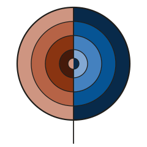
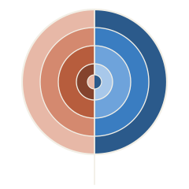
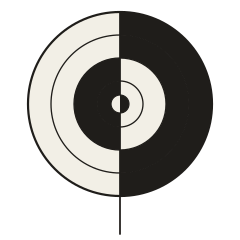

# Branding

The mark is the **iris**. Everything in this directory is generated:

```bash
python3 branding/gen_brand.py
```

<p align="center">
  
  
  
</p>

## The line

> **Represent the world.**

"Represent" is the discipline's own word rather than a borrowed one: a figure
*is* a representation in the strict sense, and this whole skill is a set of
constraints on making an honest one. "The world" fixes the scope. Not your data,
not your slides, anything you can point at.

Set it in caps under the wordmark, in `w2` from the ramp, or in italic on its
own. Do not append a product or platform name to it. It lives in exactly one
place, `SLOGAN` in `gen_brand.py`, so the lockup and the docs cannot disagree.

## What it is

A disc split down the middle, with an ordered colour ramp in each half, and the
two halves running that ramp in opposite directions. Pale at the rim and deep at
the core on the left; the reverse on the right. The centre pip repeats the rim
rather than the core, so reading inward on either side gives pale, deep, pale.
The line down the middle is the axis the ramp reverses across, and below the rim
it carries on as a stem.

It comes from two Hilma af Klint paintings, and both are load-bearing:

| Source | What it gives |
| --- | --- |
| *The Swan*, Group IX/SUW (1915) | The structure: a donut split down the middle with a different stack of rings in each half. |
| Series VIII, *Utgångsbild* (1920) | The fill: an ordered ramp running from a hot core out to a pale rim. |

The duality is carried by **lightness, not hue**. That is the whole reason the
design works: collapse the eight ramp steps to two values and all four quadrants
survive, so the one-colour plate is not a degraded version of the mark but the
same drawing. It is also why the mark holds at 16px, where the small variant
drops to two bands, the fewest that can still show an inversion.

## Files

| File | Use |
| --- | --- |
| `iris.svg` | Follows the viewer's light or dark setting. Web, apps, anything that renders SVG properly. |
| `iris-light.svg` `iris-dark.svg` | Fixed scheme. Use these in Markdown and anywhere the renderer strips `<style>`. |
| `iris-mono.svg` | One colour, for stamps, embroidery, fax, and single-ink print. |
| `iris-small*.svg` | 32px and below. Two bands, no pip, no stem. |
| `lockup-light.svg` `lockup-dark.svg` | Mark plus wordmark. |

There are two kinds of file here and the difference is not cosmetic. `iris.svg`
and `iris-small.svg` carry CSS custom properties and a `prefers-color-scheme`
query, so a single file follows the viewer. **Every other file has its colours
written out as literal hex**, because GitHub strips `<style>` from SVG when it
renders README images, which would resolve every `var()` to nothing and paint
the whole mark solid black. The README points at the flattened files.

## Colour

Two hue angles, 39.9° and 251.1° in OKLCH, four steps along each. No new hue
enters the identity, only new steps along two that were already there.

| | 1 (deep) | 2 | 3 | 4 (pale) |
| --- | --- | --- | --- | --- |
| light, warm | `#451A0B` | `#893411` | `#B66346` | `#CE9581` |
| light, cool | `#082A4A` | `#065494` | `#4481BF` | `#82A8D3` |
| dark, warm | `#84432D` | `#B75D3D` | `#D4896F` | `#E7B8A7` |
| dark, cool | `#2B5A8B` | `#3A7DC1` | `#6EA3DB` | `#A8C8EA` |

Ground and ink are `#F2EFE6` and `#1F1D1A`, swapped in dark mode.

These are ordered ramps, not categories, so they are gated as ramps. The
categorical checks fail a correct ramp by design: it spans the lightness band,
and its pale steps drop under the chroma floor. All four pass `--ordinal`:

```bash
python3 scripts/validate_palette.py "#451A0B,#893411,#B66346,#CE9581" --ordinal --surface "#F2EFE6"
python3 scripts/validate_palette.py "#082A4A,#065494,#4481BF,#82A8D3" --ordinal --surface "#F2EFE6"
python3 scripts/validate_palette.py "#84432D,#B75D3D,#D4896F,#E7B8A7" --ordinal --surface "#1F1D1A" --mode dark
python3 scripts/validate_palette.py "#2B5A8B,#3A7DC1,#6EA3DB,#A8C8EA" --ordinal --surface "#1F1D1A" --mode dark
```

Single hue, monotone lightness, every adjacent gap over the 0.06 floor, pale end
still clearing the surface. The dark ramps sit higher up the lightness scale
than the light ones on purpose: in dark mode it is the *dark* end that has to
clear the surface, and an L of 0.40 against `#1F1D1A` only reaches 1.76:1.

## Rules

- **Do not recolour it.** The ramps are gated; a hand-picked substitute is not.
- **Do not flip the halves.** Pale-outside is always the left half. The
  inversion is the mark; a mirrored copy reads as a different logo.
- **Below 32px use the small variant.** The full mark's four bands close up.
- **Do not put the stem back on the small variant.** It is the first thing to
  disappear and the first thing to look like an artefact.
- Clear space: half the disc's radius on every side.

## Attribution

The mark is an original drawing. It is *after* two paintings by Hilma af Klint
(1862 to 1944), both long in the public domain, and it copies neither. Note that
the af Klint Foundation uses *The Swan* as its own icon, so this mark takes that
painting's structure and none of its colours or proportions.

Exploratory work, including the mandala and the three marks that were not
chosen, lives under `assets/logo/`. It is not the identity. This directory is.
